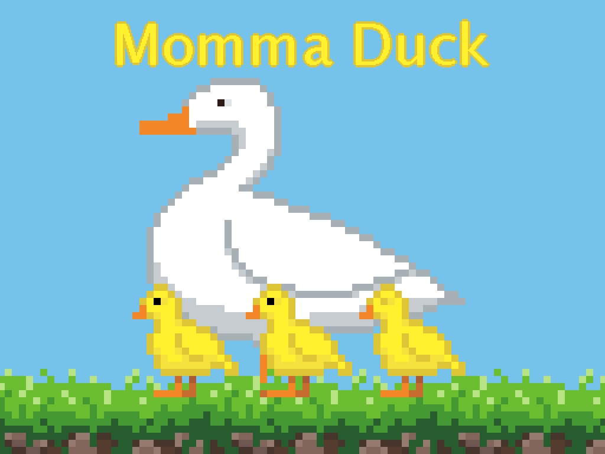
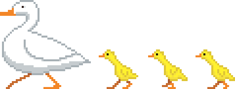

# Momma Duck

> _**[Play the game!](https://levi.dev/momma-duck)**_
> 
> _**[Watch the gameplay video!](https://www.youtube.com/watch?v=QYv0xNa0bO8)**_
> 
> _**[Checkout the original version that was submitted to GMTK!](https://github.com/levilindsey/gmtk-2021)**_

  

> _Collect your ducklings and lead them to safety!_

> This is a **point-and-click platformer**!

## Software used

-   **[Godot](https://godotengine.org/)**: Game engine.
-   **[Aseprite](https://www.aseprite.org/)**: Pixel-art image editor.
-   **[Bfxr](https://www.bfxr.net/)**: Sound effects editor.
-   **[DefleMask](https://deflemask.com/)**: Chiptune music tracker.
-   **[Scaffolder](https://godotengine.org/asset-library/asset/969)**: A framework from the Godot Asset Library that provides some general app infrastructure (like GUI layout and screen navigation).
-   **[Surfacer](https://godotengine.org/asset-library/asset/968)**: A framework from the Godot Asset Library that provides procedural path-finding across 2D platforms.

## Licenses

-   The code is published under the [MIT license](LICENSE).
-   The art assets (files under `assets/images/`, `assets/music/`, and `assets/sounds/`) are published under the [CC0 1.0 Universal license](https://creativecommons.org/publicdomain/zero/1.0/deed.en).
-   This project depends on various pieces of third-party code that are licensed separately. Here are lists of these third-party licenses:
    -   [addons/scaffolder/src/config/scaffolder_third_party_licenses.gd](https://github.com/SnoringCatGames/scaffolder/blob/master/src/config/scaffolder_third_party_licenses.gd)
    -   [addons/surfacer/src/config/surfacer_third_party_licenses.gd](https://github.com/SnoringCatGames/surfacer/blob/master/src/config/surfacer_third_party_licenses.gd)
    -   [src/config/third_party_licenses.gd](./src/config/third_party_licenses.gd)

  

